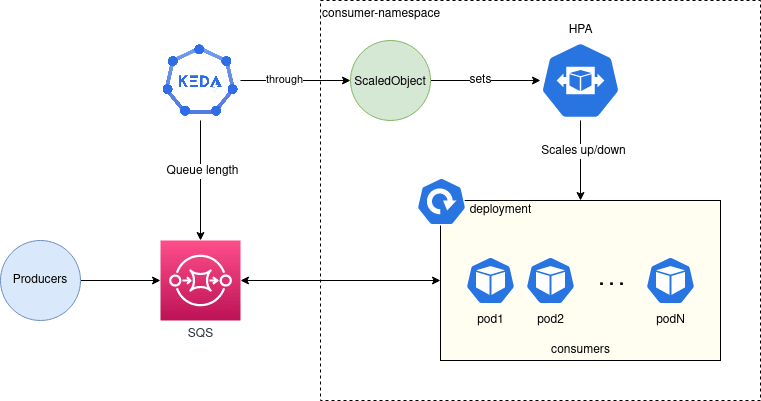
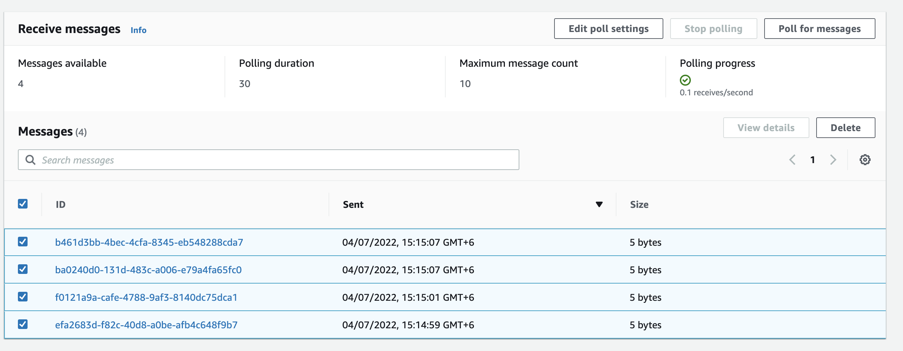

# Event-driven Horizontal pod autoscaling using KEDA and AWS SQS


## What is KEDA? 
[KEDA](https://keda.sh/docs/2.7/concepts/) is a Kubernetes-based Event Driven Autoscaler. With KEDA, you can drive the scaling of any container in Kubernetes based on the number of events needing to be processed.

KEDA is a single-purpose and lightweight component that can be added into any Kubernetes cluster. KEDA works alongside standard Kubernetes components like the Horizontal Pod Autoscaler and can extend functionality without overwriting or duplication. With KEDA you can explicitly map the apps you want to use event-driven scale, with other apps continuing to function. This makes KEDA a flexible and safe option to run alongside any number of any other Kubernetes applications or frameworks.

## How it works with AWS SQS ?
KEDA uses the metrics obtained by the keda operator metrics apiserver. With these metrics, the keda operator sets the ScaledObject to manage the HPA that controls the deployment. We need to deploy this ScaledObject in the same namespace as the deployment.



## Use Case:
Kubernetes Horizontal Pod Autoscaler (HPA) is a wonderful thing, but scaling only by CPU and memory metrics is just not enough in certain occasions.

Let’s say you have an SQS queue and you want to scale your pods by its length. The native HPA does not have support for this. That’s where KEDA comes in. 
KEDA is a Kubernetes based Event Driven Autoscaler that works alongside the HPA to scale your pods by specific metrics or events. In this case, we’ll scale our pods by queue length.

## Prerequisites:
1. EKS Cluster
2. AWS SQS Queue

## Tools:
1. Helm v3
2. kubectl

## Configuration:

### 1. IAM 

Before deploying KEDA we need to do some configurations:

* Create an IAM role with correct permission to get queue attribute for the ```keda-operator``` service account.
* Assign that role to the service account.

#### IAM policy:
This is the policy the operator needs to set for ```keda-operator```service account IAM Role.
```
{
    "Version": "2012-10-17",
    "Statement": [
        {
            "Effect": "Allow",
            "Action": "sqs:GetQueueAttributes",
            "Resource": "<SQS_QUEUE_ARN>"
        }
    ]
}
```
#### IAM Role:
This role uses the policy we created in the previous step.

Once the role is created, we need to update the Trusted entities to associate the service account ```keda-operator``` to the role. Here’s the JSON:
```
{
  "Version": "2012-10-17",
  "Statement": [
    {
      "Sid": "",
      "Effect": "Allow",
      "Principal": {
        "Federated": "<OIDC_PROVIDER_ARN>"
      },
      "Action": "sts:AssumeRoleWithWebIdentity",
      "Condition": {
        "StringEquals": {
          "<OIDC_PROVIDER_URL>:sub": "system:serviceaccount:<KEDA_NAMESPACE>:keda-operator"
        }
      }
    }
  ]
}
```
### 2. Deploy Keda:
We will deploy KEDA using helm. To obtain the default chart values, you can execute these commands:
```
 $ helm repo add kedacore https://kedacore.github.io/charts
 $ helm update repo
 $ helm show values kedacore/keda > values.yaml
 ```
We need to modify default ```values.yaml ```file to add iam role in service account for KEDA which we have created. Now we just add:

* ```eks.amazonaws.com/role-arn: <KEDA_OPERATOR_ROLE_ARN> ``` as serviceAccount annotation. 
* Pod’s uid to 1001. This is done by modifying the ```podSecurityContext  ```according to this permission related [Issue #837](https://github.com/kedacore/keda/issues/837).

values.yaml should be look like that:
```
# Default values for keda.
# This is a YAML-formatted file.
# Declare variables to be passed into your templates.

image:
  keda:
    repository: ghcr.io/kedacore/keda
    # Allows people to override tag if they don't want to use the app version
    tag:
  metricsApiServer:
    repository: ghcr.io/kedacore/keda-metrics-apiserver
    # Allows people to override tag if they don't want to use the app version
    tag:
  pullPolicy: Always

crds:
  install: true

watchNamespace: ""

imagePullSecrets: []

operator:
  name: keda-operator
  replicaCount: 1

metricsServer:
  # use ClusterFirstWithHostNet if `useHostNetwork: true` https://kubernetes.io/docs/concepts/services-networking/dns-pod-service/#pod-s-dns-policy
  dnsPolicy: ClusterFirst
  useHostNetwork: false

podDisruptionBudget: {}
  # operator:
  #   minAvailable: 1
  #   maxUnavailable: 1
  # metricServer: 
  #   minAvailable: 1
  #   maxUnavailable: 1

# -- Custom labels to add into metadata
additionalLabels:
  {}
  # foo: bar

podAnnotations:
  keda: {}
  metricsAdapter: {}
podLabels:
  keda: {}
  metricsAdapter: {}

rbac:
  create: true

serviceAccount:
  # Specifies whether a service account should be created
  create: true
  # The name of the service account to use.
  # If not set and create is true, a name is generated using the fullname template
  name: keda-operator
  # Annotations to add to the service account
  annotations:
    eks.amazonaws.com/role-arn: "arn:aws:iam::12345678:role/keda-operator"

podIdentity:
  activeDirectory:
    # Set to the value of the Azure Active Directory Pod Identity
    # See https://keda.sh/docs/concepts/authentication/#azure-pod-identity
    # This will be set as a label on the KEDA Pod(s)
    identity: ""
  azureWorkload:
    # Set to true to enable Azure Workload Identity usage.
    # See https://keda.sh/docs/concepts/authentication/#azure-workload-identity
    # This will be set as a label on the KEDA service account.
    enabled: false
    # Set to the value of the Azure Active Directory Client and Tenant Ids
    # respectively. These will be set as annotations on the KEDA service account.
    clientId: ""
    tenantId: ""
    # Set to the value of the service account token expiration duration.
    # This will be set as an annotation on the KEDA service account.
    tokenExpiration: 3600

# Set this if you are using an external scaler and want to communicate
# over TLS (recommended). This variable holds the name of the secret that
# will be mounted to the /grpccerts path on the Pod
grpcTLSCertsSecret: ""

# Set this if you are using HashiCorp Vault and want to communicate
# over TLS (recommended). This variable holds the name of the secret that
# will be mounted to the /vault path on the Pod
hashiCorpVaultTLS: ""

logging:
  operator:
    ## Logging level for KEDA Operator
    # allowed values: 'debug', 'info', 'error', or an integer value greater than 0, specified as string
    # default value: info
    level: info
    # allowed values: 'json' or 'console'
    # default value: console
    format: console
    ## Logging time encoding for KEDA Operator
    # allowed values are 'epoch', 'millis', 'nano', 'iso8601', 'rfc3339' or 'rfc3339nano'
    # default value: rfc3339
    timeEncoding: rfc3339
  metricServer:
    ## Logging level for Metrics Server
    # allowed values: '0' for info, '4' for debug, or an integer value greater than 0, specified as string
    # default value: 0
    level: 0

securityContext:
 operator:
   capabilities:
     drop:
     - ALL
   allowPrivilegeEscalation: false
   readOnlyRootFilesystem: true
 metricServer:
   capabilities:
     drop:
     - ALL
   allowPrivilegeEscalation: false
    ## Metrics server needs to write the self-signed cert so it's not possible set this
    # readOnlyRootFilesystem: true

podSecurityContext:
  operator:
   #runAsNonRoot: true
    runAsUser: 1001
    runAsGroup: 1001
    fsGroup: 1001
  metricServer:
   #runAsNonRoot: true
    runAsUser: 1001
    runAsGroup: 1001
    fsGroup: 1001

service:
  type: ClusterIP
  portHttp: 80
  portHttpTarget: 8080
  portHttps: 443
  portHttpsTarget: 6443

  annotations: {}

# We provides the default values that we describe in our docs:
# https://keda.sh/docs/latest/operate/cluster/
# If you want to specify the resources (or totally remove the defaults), change or comment the following
# lines, adjust them as necessary, or simply add the curly braces after 'operator' and/or 'metricServer'
# and remove/comment the default values
resources:
  operator:
    limits:
      cpu: 1
      memory: 1000Mi
    requests:
      cpu: 100m
      memory: 100Mi
  metricServer:
    limits:
      cpu: 1
      memory: 1000Mi
    requests:
      cpu: 100m
      memory: 100Mi

nodeSelector: {}

tolerations: []

affinity:
  {}
  # podAntiAffinity:
  #   requiredDuringSchedulingIgnoredDuringExecution:
  #   - labelSelector:
  #       matchExpressions:
  #       - key: app
  #         operator: In
  #         values:
  #         - keda-operator
  #         - keda-operator-metrics-apiserver
  #     topologyKey: "kubernetes.io/hostname"

## Optional priorityClassName for KEDA Operator and Metrics Adapter
priorityClassName: ""

## The default HTTP timeout in milliseconds that KEDA should use
## when making requests to external services. Removing this defaults to a
## reasonable default
http:
  timeout: 3000

## Extra KEDA Operator and Metrics Adapter container arguments
extraArgs:
  keda: {}
  metricsAdapter: {}

## Extra environment variables that will be passed onto KEDA operator and metrics api service
env:
# - name: ENV_NAME
#   value: 'ENV-VALUE'

# Extra volumes and volume mounts for the deployment. Optional.
volumes:
  keda:
    extraVolumes: []
    extraVolumeMounts: []

  metricsApiServer:
    extraVolumes: []
    extraVolumeMounts: []

prometheus:
  metricServer:
    enabled: false
    port: 9022
    portName: metrics
    path: /metrics
    podMonitor:
      # Enables PodMonitor creation for the Prometheus Operator
      enabled: false
      interval:
      scrapeTimeout:
      namespace:
      additionalLabels: {}
  operator:
    enabled: false
    port: 8080
    path: /metrics
    podMonitor:
      # Enables PodMonitor creation for the Prometheus Operator
      enabled: false
      interval:
      scrapeTimeout:
      namespace:
      additionalLabels: {}
    prometheusRules:
      # Enables PrometheusRules creation for the Prometheus Operator
      enabled: false
      namespace:
      additionalLabels: {}
      alerts:
        []
        # - alert: KedaScalerErrors
        #   annotations:
        #     description: Keda scaledObject {{ $labels.scaledObject }} is experiencing errors with {{ $labels.scaler }} scaler
        #     summary: Keda Scaler {{ $labels.scaler }} Errors
        #   expr: sum by ( scaledObject , scaler) (rate(keda_metrics_adapter_scaler_errors[2m]))  > 0
        #   for: 2m
        #   labels:
```
To deploy KEDA, we only execute:
```
$ helm install keda kedacore/keda --values values.yaml --namespace keda 
```
#### Output:
```
NAME: keda
LAST DEPLOYED: Mon Jan 3 9:42:31 2022
NAMESPACE: keda
STATUS: deployed
REVISION: 1
TEST SUITE: None
```
After a few seconds, you should have everything up and running. Check out by this command: 

```
$ kubectl get pods -n keda
```
### 3. Deploy Application:
If we have deployed our application earlier, we can skip this step. Otherwise, deploy a test ```nginx``` deployment in ```kube-test``` namespace:
``` 
$ kubectl create ns keda-test
$ kubectl create deployment nginx-deployment --image nginx -n keda-test
```
Check deployments status:
```
$ kubectl get pods -n kube-test
```

### 4. Deploy SQS Scaler:
create ``` sqs-scaler.yaml``` file with this :
```
apiVersion: keda.sh/v1alpha1
kind: ScaledObject
metadata:
  name: aws-sqs-queue-scaledobject
  namespace: keda-test
spec:
  scaleTargetRef:
    name: nginx-deployment
  minReplicaCount: 0  # We don't want pods if the queue is empty
  maxReplicaCount: 5  # We don't want to have more than 5 replicas
  pollingInterval: 10 # How frequently we should go for metrics (in seconds)
  cooldownPeriod:  20 # How many seconds should we wait for downscale  
  triggers:
  - type: aws-sqs-queue
    metadata:
      queueURL: <SQS-URL>
      queueLength: "2"
      awsRegion: "<Queue-Region>"
      identityOwner: operator

```

In this file, we used ```identityOwner: operator```  in ```triggers.metada``` to use keda-operator IAM permission to access queue. We don't need toa add  additional permission for this ScaledObject.

If you set minReplicaCount ≠ 0, the cooldownPeriod is 5 minutes, since the scaling from 1 ↔ N is handled by the HPA, you can check this issue for more info: [Issue #737](https://github.com/kedacore/keda/issues/737).

#### Let's Apply this configuration:
```
$ kubectl apply -f keda-resources.yaml
```
#### Output:
``` 
scaledobject.keda.sh/aws-sqs-queue-scaledobject created
triggerauthentication.keda.sh/keda-aws-credentials created
```

### 5. Test
Here you can type any message you want and send it to the queue. Since our scaledObject has a length of 2, we need to send 3 messages for our deployment to scale up to 2 pods.


Once you’ve sent the 3 messages, check if the deployment is working with:
```
$ kubectl get pods -n keda-test
```
After a few seconds you should see both pods running:
```
NAME                                READY   STATUS    RESTARTS   AGE
nginx-deployment-84cd76b964-475bt   1/1     Running   0          15s
nginx-deployment-84cd76b964-rw4zt   1/1     Running   0          3m
```
Remember that our polling time is 10 seconds, so count to 10 if nothing happens 😉

And that’s it! Our deployment just scaled up 🎉

To see if it scales down, you need to receive and delete the messages, so scroll down and click on Poll for messages:



After receiving all the messages, your deployment should scale down to zero:
```
$ kubectl get pods -n keda-test
No resources found in keda-test namespace.
```
And that’s it! If you made it to this point, it means you successfully deployed and tested KEDA with SQS 🎉.

## Reference:
1. [IAM Role for Service accounts](https://docs.aws.amazon.com/eks/latest/userguide/iam-roles-for-service-accounts.html)
2. [KEDA Concepts](https://keda.sh/docs/2.7/concepts/)
3. [KEDA helm gitbub Repo](https://github.com/kedacore/charts)
4. [AWS SQS Scaler for KEDA](https://keda.sh/docs/2.5/scalers/aws-sqs/)


